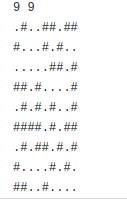

# Projeto 1-Aplicação Multithread

## Jogo da Vida

# Equipe
* Antonio Gabriel da Silva Fernandes	    RA 231551
* Daniel Mendes dos Santos    RA 214752
* Lindon Jonathan Sanley dos S. P. Monroe    RA 220407
* Lucas de Paula Soares    RA 201867

## 1.Introdução 

O projeto em questão trabalha com o processamento multithread do jogo da vida de Conway que, em síntese, consiste no processamento matricial em quadrantes para cada thread utilizada.
Diante disso, basta compreender as regras jogo da vida de Conway e como elas são representadas no projeto:  

- No início da execução do código, deve ser dado o tamanho da Matriz M (m x n) separados por espaço;
- Toda célula viva é representada por “#”;
- Toda célula morta é representada por “.”;
- Qualquer célula viva com menos de dois ou com mais de três vizinhos  vivos morre;
- Qualquer célula morta com exatamente três vizinhos vivos se torna uma célula viva;
- Qualquer célula viva com dois ou três vizinhos vivos continua no mesmo estado para a próxima geração.

A partir disso, estabeleceu-se que a entrada do projeto é dada aleatoriamente na forma:

***Figura 1. Matriz aleatória***

Dessa maneira a matriz pode ser lida e processada em ciclos pelo algoritmo projetado pelo grupo.**

## 2. Algoritmo

A estratégia proposta pelo grupo fora a de, diante da matriz apresentada, criar quadrantes de tamanho até 5x5 (fixamente) para ser processado por threads individualmente e, para caso do quadrante não ser 5x5, ele é tratado como sendo um quadrante menor a x b tal que a,b ∊ ℕ | a<=5 ,b <=5. 
Ou seja, o primeiro quadrante a ser tratado na matriz da **figura 1** , seria:

***Figura 2. Primeiro quadrante***

Seguindo essa lógica, para o extremo direito e o inferior da matriz, temos quadrantes com lado menor do que o limite de 5x5. É o caso do último quadrante, que é 4x4:

***Figura 3. Último quadrante***

A partir disso, em ambos os casos seus processamentos são dados por uma leitura da vizinhança de todas as células do quadrante e a aplicação das regras do jogo baseadas nisso. São ignoradas celúlas que ultrapassariam os limites matriciais e a própria célula. Em seguida, sobrescreve-se o novo estado da célula em uma nova matriz.

## 3. Código e Funções

### 3.1 Main

Dado o algoritmo apresentado, bastou apenas traduzi-lo para um código em C que utilizasse a biblioteca pthread. Essa implementação foi feita da seguinte forma: 
Primeiramente, para as definições iniciais, tivemos a inclusão das bibliotecas e da definição das constantes de limitação da matriz:

-

***Figura 4. Definições e chamada de bibliotecas***

A função main começa alocando e escaneando a matriz conforme a entrada dada na introdução e, em seguida, faz-se a divisão em quadrantes para a criação das threads.

`	`

***Figura 5. Main (parte 1)***

	Em seguida, inicia-se o fluxo principal do código, onde, em um loop infinito: Se cria a nova matriz a ser exibida no próximo ciclo, percorre-se a matriz de threads passando como argumentos para “f_thread” a dimensão da matriz, localização de início da thread na matriz e a matriz lida. Esses argumentos foram  colocados na estrutura “f_thread_args”,  para maior clareza no código.

***Figura 6. Main (parte 2)***

***Figura 7. Main (parte 3)***

Feita essas execuções da função, a matriz já estará processada (função melhor explicada no tópico seguinte) e basta apenas lidar com a impressão da matriz, sua desalocação, e a anulação das matriz de threads para um novo ciclo a ser executado em seguida.

***Figura 8. Main (parte 4)***

### 3.2 Funções

Para criação e tratamento da matriz de entrada, criou-se as funções de alocação e desalocação de matriz, que alocam memória dinamicamente  com o “malloc” e liberam-na com o “free”.

`	`****

***Figura 9. Alocação e desalocação***

Por fim, basta-se entender as 2 funções na qual todo o código se sustenta, pois elas fazem o processamento das threads:

- **get\_vizinhos\_vivos:** Analisa toda a vizinhança da célula em questão. A cada célula viva (“#”) encontrada, o contador de vizinhos vivos é acrescido em um. 

***Figura 10. get\_vizinhos\_vivos***

- **f\_thread:** Aqui é onde se localiza a parte central do código, onde basicamente, com os argumentos recebidos pela estrutura percorre-se o quadrante (delimitado pelos argumentos) e analisa como o auxílio da função **get\_vizinhos\_vivos** o próximo estado da célula.

***Figura 11. get\_vizinhos\_vivos***
