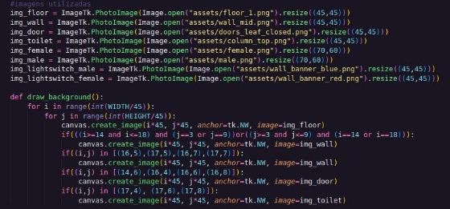

Unicamp

MC504 - Sistemas Operacionais

**Projeto 2**

**Aplicação de Semáforo no Problema do banheiro unissex**

Antonio Gabriel da Silva Fernandes RA 231551 Daniel Mendes dos Santos    RA 214752

Lindon Jonathan Sanley dos S. P. Monroe    RA 220407 Lucas de Paula Soares    RA 201867

Campinas 2022

**1.Introdução**

O projeto em questão trabalha com a utilização da programação em multithread e da técnica de semáforos a fim de dar uma solução para o problema do banheiro unissex de forma a atingir uma sincronização harmoniosa na utilização das cabines e enfileiramento de pessoas.

Diante disso, basta compreender qual é o problema do banheiro unissex. Como abordado em aula, este é um dos problemas retirados do livro “ The Little Book of Semaphores” e consiste em um dos problemas que melhor aborda a dinâmica para a criação e aplicação de semáforos. Diante disso, este apresenta o seguinte enunciado:

- Existe uma fila única até o banheiro onde existem homens e mulheres a fim de utilizá-lo;
- O banheiro possui 3 diferentes cabines que podem ser utilizadas simultaneamente, mas somente 1 pessoa por cabine;
- Homens e mulheres podem usar o banheiro com a pessoa do mesmo sexo, contudo não podem usa-lo banheiro ao mesmo tempo com uma pessoa do sexo oposto;

Além disso, estabeleceu-se que deve-se ao fazer a sincronização da utilização do banheiro é adequado que não existam deadlocks e nem starvation em nenhuma parte da resolução do problema. Ademais, admite que é aleatório o sexo da próxima pessoa que entrar na fila é sempre aleatório e que cada pessoa demora diferentes tempos para ir ao banheiro.

**Figura 1. Banheiro unissex**

A partir disso, supõe-se uma entrada em um randômica e limitada a 50 pessoas que utilizam da cabine sincronizadamente levando em consideração seus diferentes tempos.

2. **Algoritmo**

A estratégia proposta pelo grupo foi adotar o algoritmo pelo qual se mantém o máximo de pessoas dentro nas cabines e caso não seja possível a próxima pessoa da fila entrar ela entra em um estado de espera. Nesse sentido, cabe-se determinar quais são os casos de espera:

- Se houver 0 pessoas no banheiro a pessoa pode entrar;
- Se o número de pessoas no banheiro for igual a 3, a pessoa deve entrar em espera;
- Se 0 < número de pessoas no banheiro < 3, deve-se verificar o sexo da pessoa e das pessoas dentro do banheiro e, caso seja oposto a pessoa entra em espera, já se for do mesmo sexo a pessoa deve entrar no banheiro;

Dadas essas condições de espera, deve-se ressaltar que a aplicação da espera é feita ante a prioridade criada pela fila, ou seja, se a pessoa que está na frente na fila entra em espera ela deverá ter prioridade caso o banheiro seja liberado, dessa maneira evitando eventuais starvations ocorridos ocasionados por eventuais “cortes de fila” causados por pessoas do mesmo sexo já podendo entrar no banheiro enquanto a pessoa da frente do sexo oposto está em espera.

3. **Código e Funções**

O código em questão se estrutura em 2 partes, uma animação feita em python (client\_graphic.py) e a estruturação do algoritmo em si feito em C (unisex.c), ambos conectados por via Websocket como pode-se observar pelo início do trecho da função main do código em C.

**Figura 2. Server parte 1**

Acima, cria-se o websocket e define a porta em que ele estará funcionando, além de possíveis erros na sua criação são tratados.

**Figura 3. Server parte 2**

Em seguida, faz-se o bind da porta ao websocket criado e se coloca em espera a conexão do servidor com a janela gráfica.

Além disso, ainda na função main, são estruturadas e inicializadas as threads e os semáforos do código.

**Figura 4. Main**

Como pode-se observar, chamam-se os semáforos utilizados nas threads e cria-se as threads já definindo aleatoriamente o sexo da pessoa. Mas para que tudo isso ocorra deve-se chamar as bibliotecas e definir as variáveis e constantes aqui expressas. como se pode observar na figura 5:

**Figura 5. Chamada de bibliotecas e definição de variáveis**

1. **Janela gráfica em python**

Objetivamente, a parte gŕafica em “client\_graphic.py” se sustenta no mapeamento de imagens em pixel art sobre uma janela gráfica criada pela biblioteca tkinker a qual se atualizará dependendo de cada uma das informações recebidas pela conexão websocket criada.

**Figura 5. Parte gráfica 1**

Acima, chama-se as bibliotecas e define-se as estruturas de lista para a fila, um vetor de strings vazio para o banheiro e o estado inicial ‘F’ (female) para o sinal. Além disso, cria-se a janela gráfica em questão e se estabelece a conexão via web-socket com o servidor anteriormente criado.

Em seguida a essa parte inicial, deve-se tratar cada parte do código setorizada em funções diferentes, para que se trabalhe separadamente com cada uma das informações recebidas.

**Figura 6. Parte gráfica 2**

Dessa forma, aqui na figura 5, remapeia-se as imagens em pixel arte para um tamanho adequado (disponíveis em assets) e se faz a função que cria e posiciona os elementos do cenário principal da animação. Os elementos dessa função são estáticos durante a animação e não são atualizados para cada interação do programa.

**Figura 7. Parte gráfica 3**

Diferente da função do background a função para desenhar pessoas (figura 6) se mapeia e se atualiza dependendo dos estados das estruturas “people\_queue” e “bathroom” de forma a colocar as imagens de macho ou fêmea nas posições indicadas conforme as strings “M” ou “F” nas posições das estruturas.

**Figura 8. Parte gráfica 4**

Nesta função é verificar-se a variável “light” e altera a imagem na posição, dependendo do estado de“M” ou “F”.

**Figura 9. Parte gráfica 5**

Ademais, esta é a função mais importante de todo o código, pois esta decodifica a mensagem recebida pelo socket ao verificar as palavras-chave “Mulher”, “entrou” e “saiu”. A partir disso atualiza as variáveis de fila, banheiro e sinal.

**Figura 10. Parte gráfica 6**

Por fim, como centro da execução faz-se esse “try catch” com “while” contínuo para sempre manter a janela em execução e, dentro deles, há o trecho onde se recebem e tratam os dados do websocket os quais são inseridos em uma fila de execução que é percorrida em execuções onde são chamadas as funções de decodificação e atualização descritos acima.

2. **Lógica do Banheiro Unissex**

Podemos dividir a lógica de funcionamento do banheiro unissex em duas partes. Primeiro, o processo da pessoa na fila, até ser o primeiro da mesma. Depois, o processo de conseguir esperar por uma cabine vaga, até sair do banheiro.

1. **Fila do banheiro:**

Como visto na função main, cada pessoa é representada por uma thread, essas threads querem usar um recurso compartilhado, as três cabines do banheiro. Homens são m\_thread e mulheres são f\_thread.

Quando uma thread é criada, é como se a pessoa entrasse na fila. Isso é feito com o envio da mensagem de que a pessoa entrou na fila, para o script de interface gráfica, utilizando um lock para que cada thread faça isso organizadamente, e também com a thread solicitar o semáforo turnstile.

Esse turnstile é um recurso com valor igual a 1, e é solicitado por todos, tanto por homens quanto mulheres. Isso implica que funcione como um lock e que quando uma thread possa utilizar o mesmo, signifique que é a primeira posição da fila, pois todas que entraram na fila foram utilizando e liberando o recurso na ordem.

Ao conseguir o turnstile, a thread solicita o mutex do seu respectivo gênero. Nesse ponto, ela soma em 1 o contador de pessoas do seu gênero querendo entrar no banheiro ou dentro do banheiro. Se for a primeira pessoa, ela tenta pegar o recurso empty. Esse recurso também tem valor inicial igual a 1, então a pessoa, que é a primeira do seu gênero a tentar entrar no banheiro só pode entrar se o banheiro estiver vazio, ou seja, se o recurso estiver disponível.

Após isso, a pessoa libera o mutex, e libera o turnstile, fazendo com que outras pessoas possam passar por essa parte.

O turnstile é o que impede o starvation, isso porque ele é um recurso utilizado pelos dois gêneros, fazendo com que, independentemente do gênero, cada pessoa tenha sua vez de fazer o processo entre o wait e o post desse recurso. Dessa forma, quanto um homem é o primeiro da fila, por exemplo, mesmo que tenham duas mulheres no banheiro, e outras na fila querendo entrar, ainda assim, como ele tem o turnstile, ele espera até empty ser liberado e ele poder entrar, sem que outras mulheres possam entrar enquanto ele não liberar o turnstile, que só é feito após ele passar pelo empty.

**Figura 11. f\_thread parte 1**

2. **Entrada e saída do banheiro:**

Quando chega sua vez de usar o banheiro, a thread deve solicitar uma cabine (linha 46), ao conseguir esse recurso, envia para a interface gráfica que conseguiu entrar. Fica por um tempo aleatório utilizando o banheiro, e então libera o recurso da cabine (linha 56).

Após isso comunica que saiu do banheiro. Depois, utiliza um lock para poder diminuir em 1 a quantidade de pessoas do seu gênero dentro do banheiro ou tentando entrar (linha 66). Caso a quantidade chegue a 0 neste ponto, o recurso empty é liberado. Assim, uma pessoa de outro gênero pode entrar.

**Figura 12. f\_thread parte 2**
